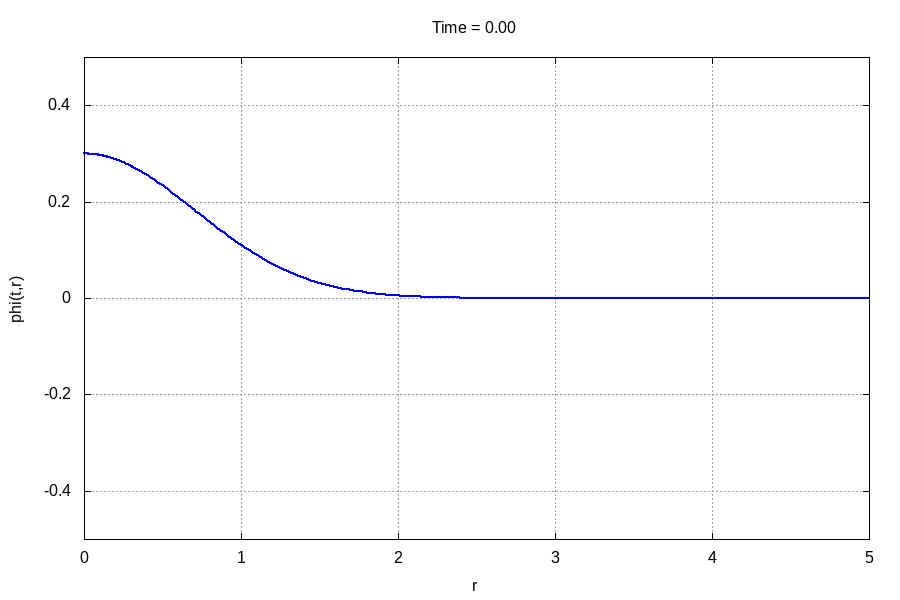
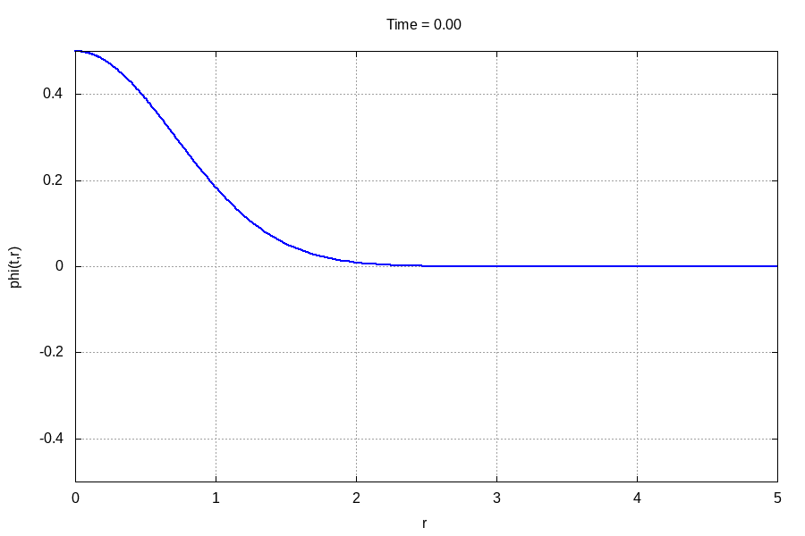

# SFcollapse1D 2.0
## Copyright (c) 2020, Leonardo Werneck
### Licensed under the GNU General License v3.0 or later (see LICENSE file for details)
Modified by: Lucas P. Francisco; Amanda G. Sato. (2021)

This is a short, user-friendly, and well-documented code to study the gravitational collapse of massless scalar fields in spherical symmetry. It uses the ADM formalism and follows the original seminal study of [Matt Choptuik in 1993](https://journals.aps.org/prl/abstract/10.1103/PhysRevLett.70.9).

# Compilation

## General remarks

To compile the code you will need a `C++` compiler. I use [gcc](https://gcc.gnu.org/) and thus that is the default behaviour of the `Makefile`. If you wish to use a different compiler, then you must change the `CXX` variable inside the `Makefile`. The code also makes use of [`OpenMP`](https://www.openmp.org/), but if you do not want it or do not have it, simply remove the `-fopenmp` flag from the `Makefile`. Finally, if you choose to change the `-O2` flag to `-Ofast`, the code will still work, but the NaN checker function will break.

## Compilation of the code

To compile the code, go to the root directory and type

`$: make`

Compilation can be made faster, while still being safe on memory, by running

`$: make -j`

This will create the `SFcollapse1D` executable, while also creating the `obj/` and `out/` directories.

## Compilation of the documentation

To compile the documentation, go to the `doc/` directory and type

`$: make`

It will take a few seconds to compile the documentation, which will generate the file `SFcollapse1D.pdf`.

# Running an example in the weak field regime

To run a simple example, which will ensure that the code has compiled properly, type

`$: ./SFcollapse1D 200 10 10 0.2 0.3`

The entire run should take less than 10 seconds. If you have `gnuplot` installed *and* the `gif` terminal, go to the `animations/` directory and type

`$: gnuplot -e "which_var='scalarfield'" anim.gp`

This should produce the following `.gif` animation:

# Running an example in the Strong field regime

To run a simple example, which will ensure that the code has compiled properly, type

`$: ./SFcollapse1D 200 10 10 0.2 0.3`

The entire run should take less than 10 seconds. If you have `gnuplot` installed *and* the `gif` terminal, go to the `animations/` directory and type

`$: gnuplot -e "which_var='scalarfield'" anim.gp`

This should produce the following `.gif` animation:

# Adding a Cosmological constant

The original version created by Leonardo Werneck can only solve the equations in an assintoptic flat space-time for a massless scalar field. This new version allows for the inclusion of a cosmological constant (positive or negative) that creates the possibility for solving the equations of evolution of a massless scalarfield in a assimptotic dS(https://en.wikipedia.org/wiki/De_Sitter_space) or adS spacetime(https://en.wikipedia.org/wiki/Anti-de_Sitter_space). To configure the value of the cosmological constant is only necessary to change the value of the variable: 

`#define COSMOLOGICAL_CONSTANT (0)`

in the file `macros.hpp`.

#Phantom fields

Is possible to analyse the behavior of phantom fields. To change the field to be evolved from a traditional scalarfield to a phantom field we can change the value of the variable `epsilon` from `(1)` to `(-1)` also in the `macros.hpp` file.

`#define EPSILON (1)`

